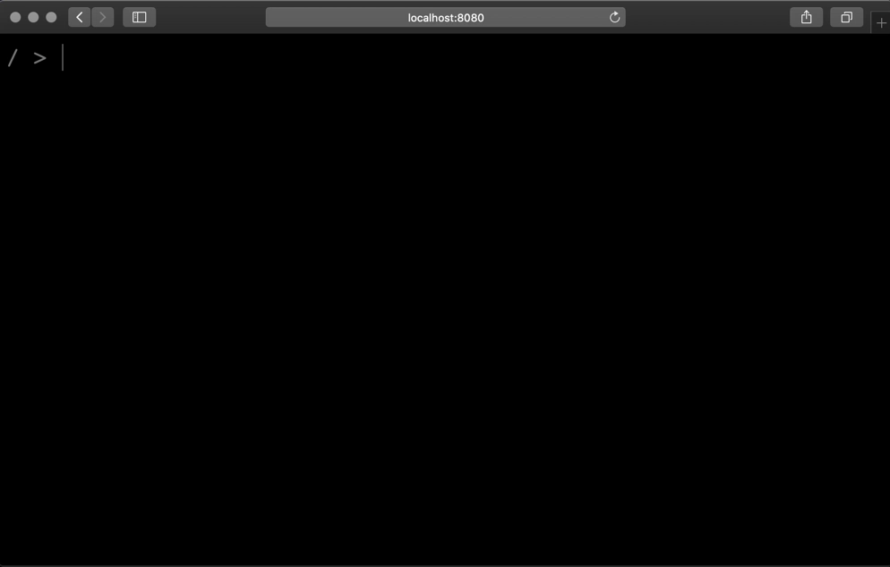

# J1.IO 
My website, but it's a terminal.

## Local Development
Build the local file manifest and run the development server: `yarn run build:localFileManifest && yarn run start:dev`

## Production
Build for production: `yarn run build:localFileManifest && yarn run build:prod`
